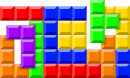

<div align="center">
  
</div>
<br>


# COD'BLAST
### Par Emery P. Maxime M. et Esteban Q.

<p align="left">
  
  
  
  <br>
  
</p>

## 🎯 Principe du jeu
Cod'Blast est inspiré du très célèbre jeu **[Block Blast](https://block-blast.io/)**.
<br>
Il s'agit d'un jeu de réflexion où l'on dispose des pièces sur une grille pour effacer des lignes et des colonnes. L'objectif est d'optimiser l'espace stratégiquement pour enchaîner les combos et obtenir le plus haut score.
<br><br>
**Système de points :**
- Vous gagnez 100 points par ligne complétée.
- Vous gagnez +50 points pour deux lignes complétées simultanémment.

## 📥 Installation
### 1️⃣ Installer NodeJS :

- **Ouvrez votre terminal**

- **Pour MacOS :**
  
```
    # Installer NVM
    curl -o- https://raw.githubusercontent.com/nvm-sh/nvm/v0.40.3/install.sh | bash
    
    # Lancer NVM sans relancer le terminal
    \. "$HOME/.nvm/nvm.sh"
    
    # Installer Node.js
    nvm install 24
```

- **Pour Windows :**

```
  # Installer Chocolatey
  powershell -c "irm https://community.chocolatey.org/install.ps1|iex"
  
  #Installer Node.js
  choco install nodejs --version="24.13.0"
```
### 2️⃣ Mise en place

- Extraire le fichier .zip du code source.
- Ouvrir le terminal à la racine du projet.
- Installer Vite.js :

```
npm install
```
### 3️⃣ Démarrer le serveur

- Dans un terminal à la racine du projet, démarrer Vite.js :

```
npm run dev
```

### 4️⃣ Accéder au serveur
Dans votre navigateur votre navigateur aller sur la page suivante : http://localhost:5173.


## 👥 Contributeurs
| Profil | Membre | Rôle |
| :---: | :--- | :--- |
| <a href="https://github.com/maximemlly"></a> | [**@maximemlly**](https://github.com/maximemlly) | 🖥️ Views / Assets |
| <a href="https://github.com/thegesse"></a> | [**@thegesse**](https://github.com/thegesse) | 🎮 Logique / Gameplay |
| <a href="https://github.com/devilishlyney"></a> | [**@devilishlyney**](https://github.com/devilishlyney) | 🎨 Intégration / Responsive |
